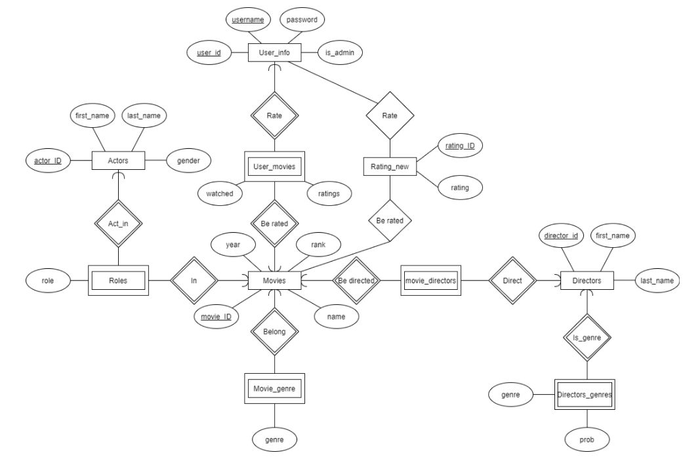
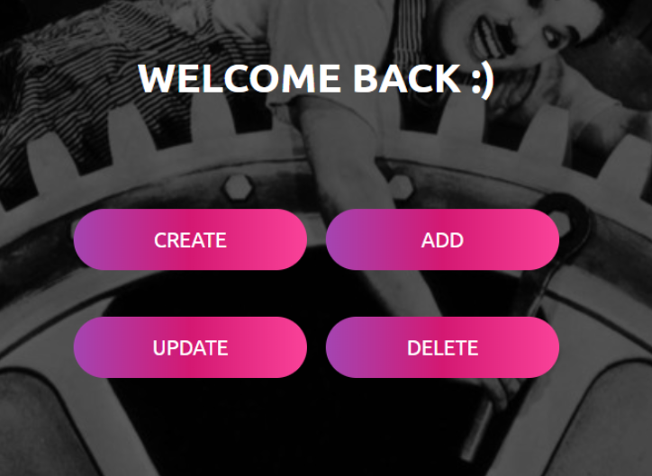
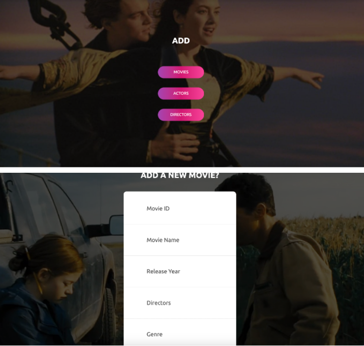
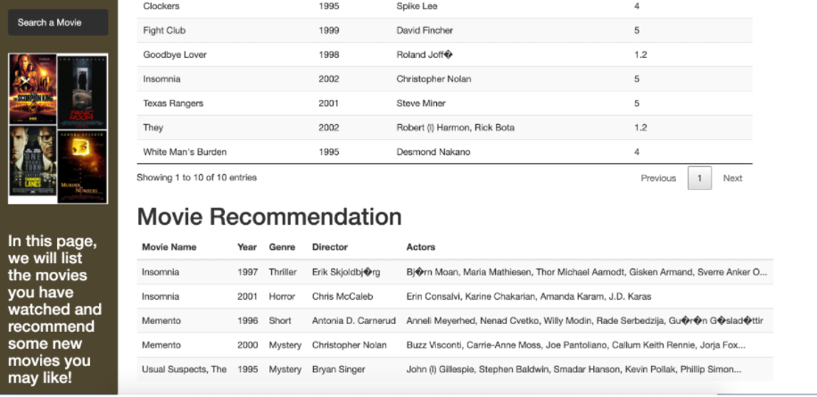
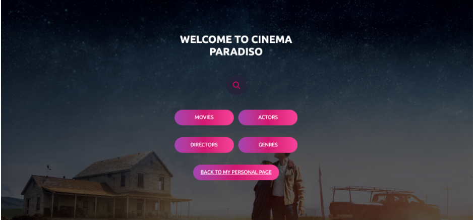
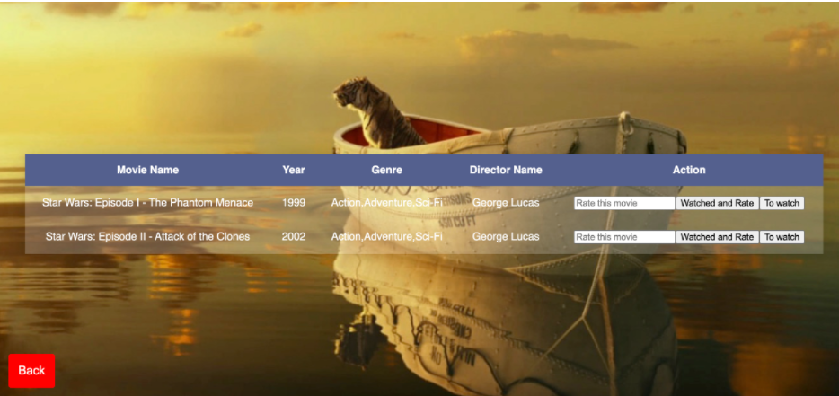

# Cinema Paradiso: Your personal movie recommendation system
Final Report 

(Summer, 2020 Submitted in fulfillment of the requirements for CS411 Final Project)\
You can view our website on: https://cinemaparadiso.web.illinois.edu/ Username: aaa Password: 123 (login as a user) 

## Introduction
When people are bored and would like to watch a movie to kill their time, they normally have no clue about what they should watch as a myriad of movies are available online. More often than not, they briefly skim through Netflix or Hulu’s homepages and choose whatever is trending. However, such a nonchalant decision may make them watch a movie they do not like. To better serve the purpose of recommending movies to people and thus help them spend their time more wisely, our project aims to allow users to search movies based on their personal preference and to recommend movies to people that are closer to their personal tastes.\
Similar applications may include IMDB, Rotten Tomatoes, Trakt, MovieLens, or Movieo. However, most of the existing websites or applications, although contain movie information, only serve one end. They either allow users to search but do not provide personal recommendations based on their past account activities. Our website allows multiple types of queries based on genres, directors, actors, etc. The highlight is that users can rate the movies if they have watched and our website is able to recommend a movie based on users’ previous queries and ratings. Even though users may have no clue of which types of movies he/she would like to watch at that point, we can still recommend movies to them based on their previous activities, such as their ratings of their watched movies.

## Data descriptives
We retrieved our data from the Relational Dataset Repository (https://relational.fit.cvut.cz/dataset/IMDb). Since the repository provides SQL access, the data were obtained fairly easily. Note that the original data were extracted from IMDb websites. The database contains a moderately large, real database of movies on IMDb. It contains 7 tables, 5,694,919 rows and 21 columns and the most common data types are numeric and string. The schema of each table can be found in the ER diagram later in this proposal. This dataset contains a large amount of information including movies’ actors, directors, and release dates, but some values may be missing. Users can query different information about movies from our database as they do in the real world.\
In addition to the movie database, another dataset we use is from Movieslens 25M dataset (https://grouplens.org/datasets/movielens/) , which provides 25 million ratings and one million tag applications applied to 62,000 movies by 162,000 users. It was released 12/2019. This dataset was used in our back-end recommendation system as training data. 

### Database schema and ER diagram

Fig 1 ER diagram

## Function descriptions
### Basic functions
The website provides two account types. Administers can login the website to create, add, delete, update movie information as well as add users and admins information. Users can login and have their own personal user profile. The user interface consists of three parts. The watch list displays the movie information that users would like to watch in the future. The watched list presents the movie information that users have watched and their previous ratings with respect to those watched movies. The last part on their interface includes the website recommended movies based on their past activities, including their ratings with respect to those movies. Both account types can perform queries based on movie names, genres, directors, and actors. Based on the search results, users and admins can rate movies, add movies to the watched list, or add movies to the to-watch list.\
For instance, in order to search movies, on the search webpage, we have multiple labels for search options, such as movies, actors, directors, and genres. We use search.php as an action and post as a method. Once the user clicks one of the buttons, which is a type of submit, we check the search types and have search_result.php file to run a sql to get corresponding data from our database. The returned results will be shown in a table on the webpage. If the query returns nothing, a warning of “No records in our database” will pop up.

### Advanced functions
he advanced function is recommending movies based on users’ watched lists. Different from most movie recommendation websites that only present movies regarding movie genres or releasing years, our application provides a personalized interaction that can help users to find the movies that cater to their preferences to the greatest extent. More specifically, we employed collaborative filtering as the primary algorithm to realize movie recommendation. \
Relying on the database from Movieslens which is the ratings to movies from real-world users,  once a new user is created and his/her account activities were logged in our database, his/ her watched movies will be compared with ratings from existing users in our databases. If two users both have watched the movie and rate it similarly, rewards will be given to existing users. Based on this rationale, a similarity matrix between this user and all other users in our database were built. Next, we would find the movies that the most 20 similar users watched. If a movie is watched by all the similar users and at the same time rated high, the movie will be added to the recommended movie list. In this way, the movies watched most with high ratings by the similar users will be recommended to the current user. \
The reason why the recommending system is counted as an advanced function is that it is based on the **similarity and distance-based matrix** in **machine learning**. The nearer the users, which means the more similar our user to the user data in our existing database, the higher the rewards will be given to those users and their ratings with respect to certain movies will be given more weights in the ultimate recommendation. Everytime the user adds new movies in his/her watched list, the algorithm will be implemented and give recommendations based on his/her previous account activities (his/her ratings towards movies in particular). Since a large number of details are involved in this algorithm, such as tuning and similarity matrix construction, for the brevity of this final report, we do not elaborate here. Interested readers may refer to recommend.php.

## Website Dataflow
### Type1: Admin
When an admin logs into our website, he/she will see Figure 2 on his / her interface. An admin is able to create users and admins accounts, add/update/delete movies, directors, and actors information. \

Fig 2 Admin login Interface

Take add movies as an example,  as shown in Figure 3, once the admin enters all the required information and clicks submit, , the add_movie.php in cpanel will connect to the Mysql database, extract the information and insert the movie information to the related tables.

Fig 3 The interface of adding a movie 

### Type 2: Users
When users log in our website, the first interface that users will see is their own personal page, as shown in Figures 4 and 5. On this interface, “My watchlist” displays the movies that users have not watched but would like to watch in the future. “My watched movies” lists the movies that users have already watched and rated. The last panel on this interface is the movie recommendation panel. This panel may not be shown if the user has not added any movies to their watchlist or have not rated any movies yet. \
Additionally, users can also search movies, actors, directors, or movies by different genres by clicking on the “search a movie” at the left upper corner on their interface. After they enter the search interface, as shown in Figure 6, we provide four modes that users can specify, including movies, actors, directors, and genres. This will lead users to different queries. \
If our database does contain records that satisfy users’ searching criteria, they will be guided to the search result page. For instance, if we search “star wars” in movies, the resulting page will be shown as Figure 7. On the search result page, users can add the corresponding movies to their watchlist if they click “to watch” or they can also rate the movies if they have watched that movie by clicking “watched and rate”. Note that only movies can be added to users’ personal pages. If they search certain actors or directors, those actors and directors cannot be added and an error will occur. \

Fig 4 User interface I

Fig 5 User interface II

Fig 6 Search Interface 

Fig 7 An example of  search result interface\

## Contribution
Covid Now app is a free and open source project developed by Qingqing Cao (qc13@illinois.edu), Xiuyu Liu (xiuyul2@illinois.edu), Yang Du and Mingyu Chen. Any contributions are welcome. Here are a few ways you can help:
* Report bugs and make suggestions.
* Write some code. Please follow the code style used in the project to make a review process faster.
 

## License
This application is released under MIT. Some of the used libraries are released under different licenses.

